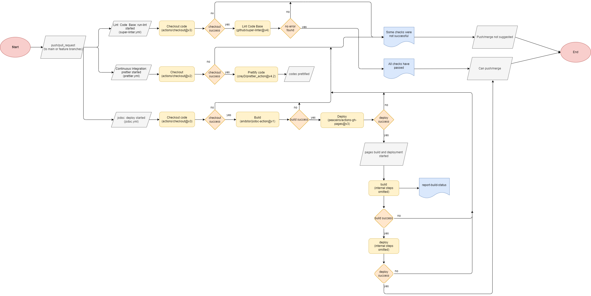

# CI/CD Pipeline status

## Plastic Triangle Group 3

---

### Notice:

- Branches: **All workflows will run for pull and push requests on the following branches:** _main, passwordHolderFeature, billDividerFeature, choresListFeature, roommateListFeature_
- Pull Requests
  - All pull requests are reviewed and approved/disapproved by the group leads when pushing to the main or feature branch
  - once approved, they get added to the main or feature branch and become a main feature

### What is currently functional

- Super Linter

  - Used to analyse code and identify problems in the codebase that may cause errors when running
  - Super Linter will check HTML, CSS, and JavaScript code

- Prettier

  - Used to format and style code to make all of our code in our repository uniform
  - Prettier will only format JavaScript code

- JSDoc
  - Used to automate the process of creating documentation for all of our code in our codebase
  - Reads all of the headers for every function in all JavaScript files and outputs to Github Pages

### Diagram:

### What is in progress

- Unit Testing
  - Unit testing is currently being developed by the DevOps team
    - unit testing will be split between testing frontend and backend
  - Jest and Puppeteer will be used to test code
  - Testing will be automated using github actions

### What is planned

- Speed up the CI pipeline
- Clean up the repository
- End to end tests
