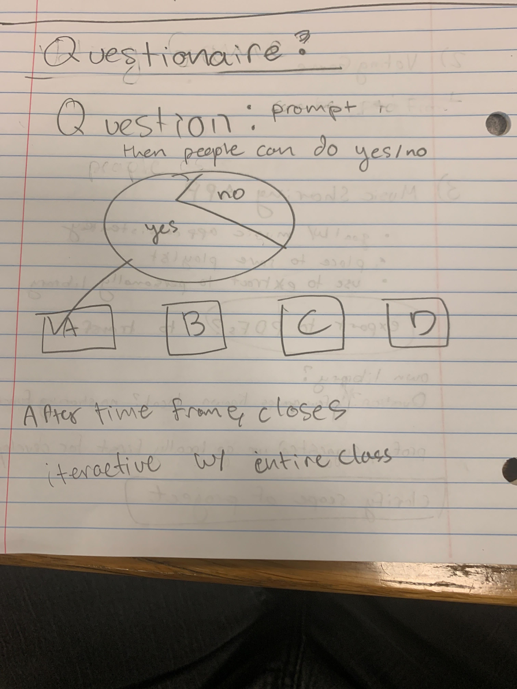
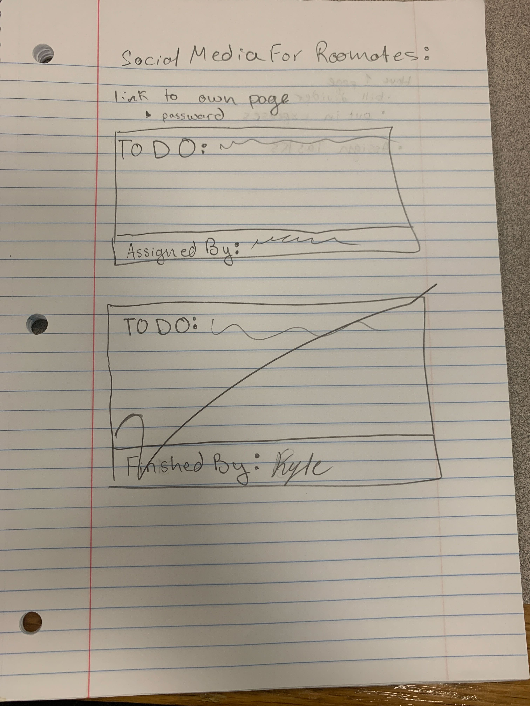
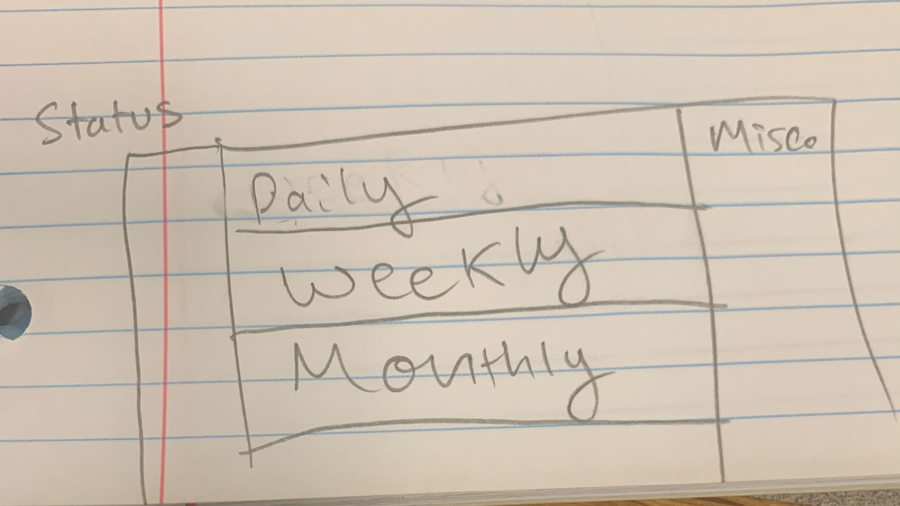

# Team 3 - Plastic Triangle
## Brainstorm Meeting 2

--------

### Members Present
- Chase Peterson
- Kalyan Sunkara
- Bryce Beeson
- Haochen Wang
- Kyle Yee
- Xun Liu (Mark)
- Raymond Romero
- Thomas Joel
- Tatsuo Kumamoto (Virtually)
- Jun Ye (Virtually)

### Meeting Time & Location
4:00 PM on 10/21/22 at WongAvery Library.

--------

## Tools Used
- Zoom (Used for video conferencing with Tatsuo and Jun)
- Google docs (Used for writing down notes)
- Pencil & Paper (Used for drawing out ideas)

--------

## Agenda
### Unfinished Business
- Reveal top 3 ideas.
### New Business
- Brainstorm 3 ideas thoroughly.
- Decide on best idea.
### Save For Next Meeting
- Plan out chosen project idea in detail.
- Create diagrams for website flow, etc.

--------

## Decisions Made
- Revealed top 3 ideas:
  - Music sharing app.
  - Voting game.
  - Social media for roommates.
- Brainstormed music sharing app:
  - Main idea:
    - Compile songs from multiple services into shareable playlists.
  - Pros:
    - Lots of available APIs to use.
    - Practically useful.
  - Cons:
    - Sounds complicated for the time frame.
    - Limited experience if made locally.
- Brainstormed voting game:
  - Main idea:
    - A group of users are prompted by a few questions.
    - Each user chooses their answer.
    - After a period of time, it will show the results.
  - Pros:
    - Relatively simple and fun.
    - Has both front and backend.
    - Easily expandable.
- Brainstormed social media for roommates:
  - Main idea:
    - A homepage for roommates with multiple functionalities.
    - Could have bill/task dividers for splitting up expenses and chores.
    - Other modules are possible (birthday lists, email reminders, wifi password, image gallery, etc.).
  - Pros:
    - Modular and expandable.
    - Practically useful (several of us wanted to use it).
  - Cons:
    - Potentially too complicated.
- We chose the social media for roommates as our best idea and brainstormed a bit more:
  - At the start, the website will be for one apartment, it wouldn't be built to support multiple. No users exist, everyone uses the page the same. Features could be added later. This also means it could be local.
  - Module ideas:
    - Grocery sharing. Grocery items are added and the bills are split up based on what everyone bought.
    - To do list: Items are added to the list, and users can select to check them off.
    - Birthday list: A simple module to start off with before the more complicated ones.
    - Password holder: Would show the wifi network name & password for anyone who needs it.
    - Image gallery: Could store memories from the past, possibly with captions, dates, etc.

--------

## Specs

Simple diagram of voting game.

Possible model for roommate app to-do list.

Another possible model for the roommate app to-do list.

--------

## Meeting Finished
4:50 PM