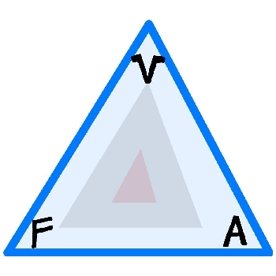

## Plastic Triangle Group Contract

- Bryce Beeson
- Chase Peterson
- Haochen Wang
- Jun Ye
- Kalyan Sunkara
- Kyle Yee
- Mark -Xun Liu
- Raymond Romero
- Tatsuo Kumamoto
- Thomas Joel

## Value Rules

---

- Communicate with your Teammates

- Be empathetic toward your teammates

- Be flexible with meeting times but still attend them

- Resolve conflicts respectfully

- Be understanding of group members

## Logistical Rules

---

- Unless there's an emergency, contact Chase or Kalyan 6 hours in advance if there’s any type of scheduling conflict.

- Upon any conflicts, must let Chase or Kalyan know first so that team leads can resolve the situation immediately.

## Technical Rules

---

- All code that will merged must be from a branch

- All pull requests should have at least one reviewer relevant to the pull request

  - Ex. working frontend, have someone working from end review it

- All code being merged should be related to a Github issue

- Everyone should be available for technical questions or advice

- No code should be merged if it doesn’t pass a Github actions build

- All Java functions should have Javadocs

- All Pull Requests should be well described about its purpose and details

## Consequences for Breaking Rules

---

1. A conversation with the person who was wrong

2. Team Leads individually talk to the person who was wrong

3. Have TA Intervention with that person

4. A Formal complaint with the TA

---

## Signature
