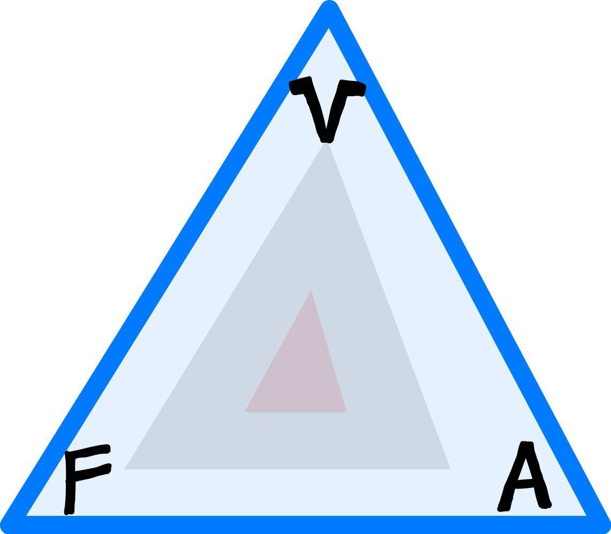

# Plastic Triangle 
;

## members:
- [Chase Peterson](https://github.com/cepeters-ucsd):
  Hi, I’m a 3rd year CS major at Sixth college. I’m excited to learn more about the technologies used in class and how to work together as a team to make a project we’re all proud of.
 
- [Kyle Yee](https://github.com/kyleyee20): 
  Hi I’m a 3rd year ECE major at Sixth college. I’m looking forward to further developing my coding skills and soft skills with the group projects. The group seems to be getting along quite well and it is going to be a fun project to partake in.
 
- [Kalyan Sunkara](https://github.com/Kalyan-Sunkara): 
  Hi I am a 4th year Computer Science major at Sixth college. My goals with CSE 110 is to improve my communication and project management skills, as well as strengthen my ability to properly create software. I enjoy group projects and look forward to creating something amazing with my team!
   
- [Thomas Joel](https://izzatommy.github.io/CSE110-WK0-1/):
 I’m a 3rd year Computer Science major from Warren college. The main things I hope to get out of CSE 110 are transferable skills and knowledge used in industry, as it will help me lead a career in software engineering.
 
- [Bryce Beeson](https://bbeeson.github.io/):
I am a 3rd year majoring in ECE going to Eleanor Roosevelt college. I am learning software engineering because I love dealing with both of the hardware and software of computers. I hope to be able to use this class to its fullest and succeed in it! 
 
- [Haochen Wang](https://haochenwang1243.github.io/):
Hi. I'm a second year math student at ERC. I have a strong interest in both Mathematics and CS. I came to CSE 110 because I think it will be a great opportunity to start practicing my teamwork skills as a software engineer. I’m looking forward to contributing to our project!
 
- [Jun Ye](https://github.com/jyip6):
Hi! I’m a fourth year math&CS student at ERC. I came to CSE 110 to dig into my interest in software development. This is my first class on software engineering. I am looking forward to make a great application with my team.
 
- [Mark-Xun liu](https://atomgroup530.github.io/CSE-110-FA22/): 
  I’m a third year Computer Engineering student. I came to CSE 110 to know better what is like to develop a complete web application and to become a better teamplayer. I enjoy spending time with the team and will make it an inspiring experience to my maximum potential.
 
- [Raymond Romero](https://raymond50romero.github.io/): 
  I’m a third year transfer Mathematics-Computer Science student. I enrolled into cse110 because I look forward to learning how to develop software on a team and better develop methods on how to be a better software engineer. 